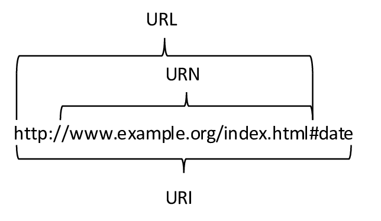

## Go 언어를 활용한 마이크로서비스 개발

### 2장 좋은 API 디자인하기

-----

api 규약 작성이 매우 중요하며 어려움

### RESTful API
- REpresentational State Transfer(표현적 상태 전송)
  - > 컴포넌트(서비스 단위) 간 상호작용의 확장성, 범용적인 인터페이스, 컴포넌트의 독립적인 배포를 강조하며 응답 지연시간 감소, 보안 강화, 레거시 시스템의 캡슐화를 위한 중간 컴포넌트 역시 강조한다. 

#### URI, URN, URL
- [RFC 3986](https://datatracker.ietf.org/doc/html/rfc3986)
- 
- URI 형식 지정의 규칙
  - 슬래시(/)는 리소스 사이의 계층적 관계를 나타내는 데 사용
  - URI의 마지막에 슬래시가 포함되어서는 안된다.
  - 하이픈(-) 사용, _ 사용 x
  - 대소문자 구분하므로 소문자 사용 권장

#### URI 경로

|표현|설명|비고|
|---|---|---|
|`GET /cats`| 모든 고양이 컬렉션|명사로 명명|
|`GET /cats/1`| 1번 고양이를 위한 하나의 문서|db의 행과 비슷. 하위 리소스를 가질 수 있음|
|`GET /cats/1/kittens`|1번 고양이의 모든 새끼 고양이들| |
|`POST /cats/1/feed` | 1번 고양이에게 먹이 주기 | 컨트롤러: 하위 경로가 없는 URI의 마지막 부분, 동사 사용|
|`POST /cats/1/feed?food=fish` | 1번 고양이에게 물고기를 먹이로 주기| 컨트롤러의 매개변수|
|`PUT /cats/2` | 2번 고양이 추가(새로운 URI 생성이 아닌 리소스 추가 저장)|컬렉션과 마찬가지로 명사로 명명|
 


#### REST URI 디자인
- `DELETE /cats/1234`: 좋은 예
- `GET /deleteCat/1234`: 나쁜 예
- `POST /cats/1234/delete`: 나쁜 예


- <b>HTTP 동사</b>
  - GET / POST / PUT / DELETE / PATCH / HEAD / OPTIONS

#### 응답코드
- 요청의 성공이나 실패를 클라이언트에게 알려주기 위한 HTTP 응답 코드
- 즉각적으로 요청의 상태를 알 수 있게 설계

나쁜 응답
```http request
POST /kittens
RESPOSNE HTTP 200 OK
{
    "status": 401,
    "statusMessage": "Bad Request"
}
```
```http request
POST /kittens
RESPOSNE HTTP 200 OK
{
    "id": "123434jvjv4564",
    "name": "Fat Freddy's Cat"
}
```

- 좋은 응답은 HTTP 상태 코드를 문자 그대로 사용하는 것

실패 응답의 좋은 예
```http request
POST /kittens
RESPONSE HTTP 400 BAD REQUEST
{
    "errorMessage": "Name should be between 1 and 256 characters...."
}
```
성공한 응답의 좋은 예:
```http request
POST /kittens
RESPONSE HTTP 201 CREATED
{
    "id": "123434jvjv4564",
    "name": "Fat Freddy's Cat"
}
```

- [IBM HTTP 요청과 응답 예제](https://www.ibm.com/docs/ko/netcoolomnibus/8.1?topic=SSSHTQ_8.1.0/com.ibm.netcool_OMNIbus.doc_8.1.0/omnibus/wip/api/reference/omn_api_http_examplehttp.html)

#### HTTP 상태 코드
- 구글에 더 자세하게 나와있지만 간략하게 정리

- 200 OK: 요청이 성공했음을 나타내는 일반적인 응답 코드
- 201 Created(생성): 요청이 성공하고 새 엔티티가 생성된 경우의 응답
- 204 No Content: 내용 없음. 클라이언트의 요청이 잘 처리되었지만 본문은 없음. DELETE 요청에 대한 응답이 될 수 있음
- 3xx: 경로 재지정. 
- 4xx: 클라이언트 에러
  - 400 Bad Request / 401 Unauthorized / 404 Not Found / ...
- 5xx: 서버 오류
  
[mozilla 상태코드 참고 사이트](https://developer.mozilla.org/ko/docs/Web/HTTP/Status)

#### HTTP 헤더
- 표준에 맞추면 모두에게 도움이 된다!

- 표준 요청 헤더
  - 요청에 대한 메타 데이터 개념
  - 요청 및 API 응답에 대한 추가 정보 제공
- Authorization - 문자열
  - 권한 부여: Authorization key 요청
  - 이런 표준 접근 방식을 따르면 클라이언트가 알아서 구현알 수 있다는데
  - ~~사실 이걸 어떻게 부여하는지는 잘 모르겠습니다!~~
- Date
  - 요청의 타임스탬프 
- Accept - 콘텐츠 타입
  - application/xml
  - text/xml
  - application/json
- Accept-Encoding - gzip, release
  - REST 엔드 포인트는 가능한 경우 gzip과 deflate 인코딩을 항상 지원해야 한다.
  - gzip 지원은 간단함: 표준 라이브러리의 일부인 `compress/gzip` 패키지 사용
  - [뉴욕타임즈 오픈소스](https://github.com/NYTimes/gziphandler)
  - 비손실 압축을 위한 인코딩,,
- 에러 리턴
  - API 사용자는 에러가 발생했을 때 여러 앤드 포인트에서 발생한 에러를 처리하는 하나의 코드를 작성할 수 있어야 하는데
  - 표준 에러 엔티티를 제공함으로써 클라이언트 또는 서버로 인한 에러가 발생할 때 클라이언트를 도와줄 수 있음
  - [마이크로소프트의 API 가이드라인 자료](https://github.com/microsoft/api-guidelines/blob/master/Guidelines.md#51-errors)


### API 버전 관리
- 초기부텉 고려해야하는 사항, 피할 수 있으면 피하는 것이 좋다!
- 버전 관리가 필요한 상황
  - 주요 변경 사항이 생기면 API 버전 번호를 증가시키는데 주요 변경사항은
    1. API나 API 매개 변수의 제거 또는 이름 변경
    2. API 매개 변수의 타입 변경(정수 -> 문자열)
    3. 응답 코드, 에러 코드 또는 실패 규약 변경
    4. 기존 API 의 동작 변경

- **시맨틱 버전 관리**
  - 메이저 버전과 마이너 버전: 1.0 에서 1은 메이저, .0은 마이너
  - 마이너의 변경은 클라이언트가 API와 상호작용하는 데 영향을 주지 않음
- **REST API의 버전 관리 형식**
  - `https://myserver.com/v1/helloworld` :URI의 일부로 버전을 선택
  - `https://myserver.com/hellowirld?api-version=1` : 쿼리 문자열의 매개 변수로 선택
  - `GET https://myserver.com/helloworld api-version:2` : HTTP 헤더를 사용해 선택

### 객체 타입 표준화
- 클라이언트에서 객체를 쉽게 처리할 수 있도록 고려
- JSON을 사용하는 경우 기본 타입으로 날짜 개념이 없다! --> ISO 표준을 사용하는 것이 도움이 된다
- 예
  - `{"date": "2021-07-08T04:52:57Z"}`
  - `{"date": {"kind": "U", "value": 1625719977221}`


### API 문서화
1. Swagger
  - YAML로 작성
  - 배책임님께서 이전에 소개해주신 API 문서 자동화 도구!

2. API Blueprint
  - 마크다우능로 작성돼 중첩된 레이어를 다루는 것보다 좀 더 자연스럽게 문서 작성 가능

4. RAML
  - RESTful API Modeling Language의 약자
  - YAML로 작성

API 문서 자동화 오픈소스(https://github.com/swaggo/swag)


## 여러가지 참고 링크
- [GO 오픈소스 참고 github](https://github.com/avelino/awesome-go)
- [Go REST API 프레임워크 추천](https://nordicapis.com/7-frameworks-to-build-a-rest-api-in-go/)